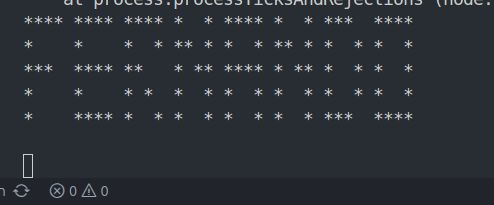

# API Convertidor de Texto a Arte ASCII

Una API REST desarrollada con Node.js y Express que convierte texto en arte ASCII utilizando asteriscos (*).

## 📋 Descripción

Esta API permite convertir cualquier texto en español a representación gráfica usando asteriscos. Cada letra del alfabeto está mapeada a un patrón de 5 líneas que forma la letra visualmente. Perfecto para crear banners de texto, mensajes decorativos o arte ASCII personalizado.

## ✨ Características

- **Conversión completa del alfabeto español** - Incluye la letra ñ
- **API RESTful** - Endpoints GET y POST para diferentes funcionalidades
- **Manejo de espacios** - Separación automática entre palabras
- **Validación de entrada** - Manejo de errores y respuestas estructuradas
- **Formato consistente** - Cada letra tiene 5 líneas de altura
- **Soporte para frases** - Convierte palabras completas y oraciones

## 🛠️ Tecnologías utilizadas

- **Node.js** - Entorno de ejecución
- **Express.js** - Framework web
- **Body-parser** - Middleware para parsing de datos

## 📁 Estructura del proyecto

```
text-to-ascii-api/
│
├── index.js           # Servidor principal y lógica de la API
├── package.json       # Dependencias y scripts
├── package-lock.json  # Lockfile de dependencias
└── README.md          # Documentación del proyecto
```

## 🚀 Instalación y uso

### Prerequisitos
- Node.js (versión 12 o superior)
- npm (viene incluido con Node.js)

### Instalación

1. **Clona el repositorio**
   ```bash
   git clone https://github.com/tu-usuario/text-to-ascii-api.git
   ```

2. **Navega al directorio del proyecto**
   ```bash
   cd text-to-ascii-api
   ```

3. **Instala las dependencias**
   ```bash
   npm install express body-parser
   ```

4. **Ejecuta el servidor**
   ```bash
   node index.js
   ```

5. **El servidor estará corriendo en:**
   ```
   http://localhost:3000
   ```

## 📡 Endpoints de la API

### GET `/`
**Descripción:** Endpoint de verificación del estado de la API.

**Respuesta:**
```json
{
  "error": false,
  "codigo": 200,
  "mensaje": "mensaje"
}
```

### GET `/mensaje`
**Descripción:** Muestra el último mensaje convertido (endpoint de prueba).

**Respuesta exitosa:**
```json
{
  "error": false,
  "codigo": 200,
  "mensaje": "arte ASCII del último texto"
}
```

**Respuesta sin mensaje:**
```json
{
  "error": true,
  "codigo": 501,
  "mensaje": "No hay ninguna palabra"
}
```

### POST `/mensaje`
**Descripción:** Convierte texto a arte ASCII.

**Cuerpo de la petición:**
```json
{
  "texto": "tu texto aquí"
}
```

**Respuesta exitosa:**
```json
{
  "error": false,
  "codigo": 200,
  "mensaje": "arte ASCII generado",
  "respuesta": "texto original"
}
```

**Respuesta de error:**
```json
{
  "error": true,
  "codigo": 502,
  "mensaje": "El texto es requerido"
}
```

## 💻 Ejemplos de uso

### Usando curl

```bash
# Verificar estado de la API
curl http://localhost:3000/

# Convertir texto
curl -X POST http://localhost:3000/mensaje \
  -H "Content-Type: application/json" \
  -d '{"texto": "hola mundo"}'
```

### Usando JavaScript (fetch)

```javascript
// Convertir texto
fetch('http://localhost:3000/mensaje', {
  method: 'POST',
  headers: {
    'Content-Type': 'application/json',
  },
  body: JSON.stringify({
    texto: 'hola mundo'
  })
})
.then(response => response.json())
.then(data => console.log(data.mensaje));
```

### Ejemplo de salida

Para el texto "**hola**", la API generará:
```
*  * ****  *    ****  
*  * *  *  *    *  *  
**** ****  *    ****  
*  * *  *  *    *  *  
*  * *  *  **** ****  
```

## 🎨 Alfabeto soportado

La API soporta todas las letras del alfabeto español:
- **Letras:** a-z, ñ
- **Espacios:** Manejo automático de separación entre palabras
- **Caracteres especiales:** Solo espacios (otros caracteres pueden causar errores)

## 📝 Códigos de respuesta

| Código | Descripción |
|--------|-------------|
| 200    | Éxito |
| 501    | No hay mensaje para mostrar |
| 502    | Texto requerido no proporcionado |

## 🛠️ Desarrollo

### Estructura del código

- **Map `abecedario`:** Contiene la representación ASCII de cada letra
- **Función `devolverEnAsteriscos()`:** Lógica principal de conversión
- **Endpoints Express:** Manejo de rutas y respuestas HTTP

### Personalización

Para agregar nuevos caracteres o modificar existentes:

1. Edita el Map `abecedario` en `index.js`
2. Cada letra debe tener exactamente 5 líneas
3. Usa espacios para formar la letra deseada

## 🤝 Contribuciones

Las contribuciones son bienvenidas. Para contribuir:

1. Fork el proyecto
2. Crea una rama para tu feature (`git checkout -b feature/NuevoCaracter`)
3. Commit tus cambios (`git commit -m 'Add: nuevo caracter especial'`)
4. Push a la rama (`git push origin feature/NuevoCaracter`)
5. Abre un Pull Request

## 📄 Licencia

Este proyecto está bajo la Licencia MIT. Ver el archivo `LICENSE` para más detalles.

## 📞 Contacto

- **Autor:** Fernando Andres
- **Email:** fernando.a.h@outlook.com
- **GitHub:** @Ferglow https://github.com/Ferglow

## 🔧 Mejoras futuras

- [ ] Soporte para números (0-9)
- [ ] Caracteres especiales (!@#$%^&*)
- [ ] Diferentes estilos de fuente ASCII
- [ ] Opción de altura de letra configurable
- [ ] Documentación Swagger/OpenAPI
- [ ] Tests unitarios
- [ ] Docker containerization

---

⭐ Si te gustó este proyecto, ¡dale una estrella en GitHub!

## Imafgen ilustrativa

